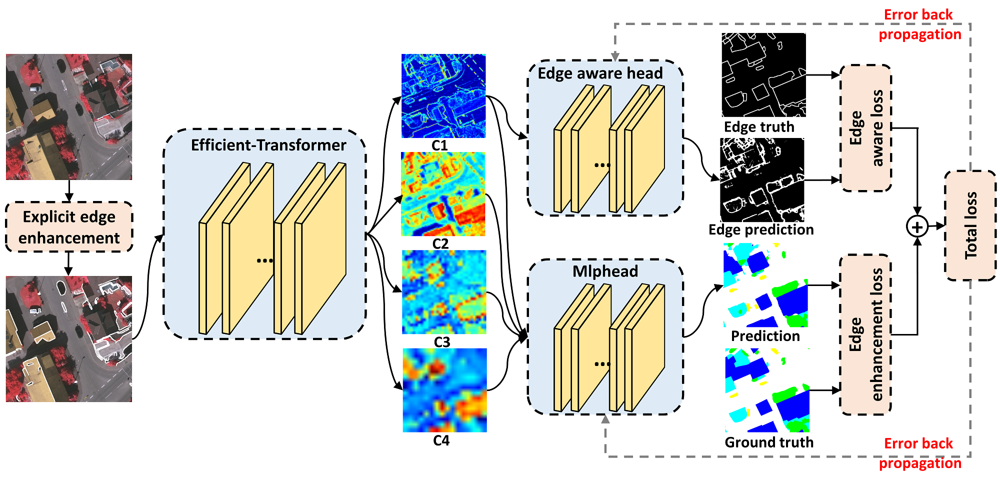

# Efficient-Transformer-for-Remote-Sensing-Image-Segmentation, [RemoteSensing](https://www.mdpi.com/2072-4292/13/18/3585)
## Introduction 
We propose an Efficient Transformer combined with an efficient backbone (ref to [Rest](https://arxiv.org/pdf/2105.13677v3.pdf)) and Mlphead to achieve light-weight design. We also improve the edge segmentation by applying explicit and implicit edge enhancement methods. Finally, our model achieves new state-of-the-art performances on Potsdam and Vaihingen datasets.   
<br/>
## Usage
* Install packages  

  This repository is based on `python 3.6.12` and `torch 1.6.0`.  
  
  ```
  git clone https://github.com/zyxu1996/Efficient-Transformer.git
  cd Efficient-Transformer  
  ```
  ```
  pip install -r requirements.txt
  ```
* Prepare datasets and pretrained weights  

  * Download `Potsdam and Vaihingen` datasets form BaiduYun, and put them on `./data `   
    `BaiduYun`: [https://pan.baidu.com/s/1MyDw1qncPKYJFK_zjFxFBA](https://pan.baidu.com/s/1MyDw1qncPKYJFK_zjFxFBA)  
    `Password`: s7f2 
    
    Data file structure of Potsdam and Vaihingen datasets is as followed.  
    ```
    ├── data                      ├── data
        ├──potsdam                    ├──vaihingen
           ├──images                     ├──images
              ├──top_potsdam_2_10.tif       ├──top_mosaic_09cm_area1.tif
              ├──top_potsdam_2_11.tif       ├──top_mosaic_09cm_area2.tif
              ...                           ...
           ├──annotations                ├──annotations
              ├──train.txt                  ├──train.txt
              ├──test.txt                   ├──test.txt
              ├──labels                     ├──labels
                 ├──top_potsdam_2_10.png       ├──top_mosaic_09cm_area1.png
                 ├──top_potsdam_2_11.png       ├──top_mosaic_09cm_area2.png
                 ...                           ...
    ```
  
  * Download the pretained weights from [Swin](https://github.com/microsoft/Swin-Transformer) and [Rest](https://github.com/wofmanaf/ResT), and put them on `./pretrained_weights`    
    Swin: `ImageNet-1K`, `ImageNet-22K` and `ADE20K Semantic Segmentation` pretrained models are used.  
    Rest: `ImageNet-1K` pretrained models are used.  
    
* Training

  * The training and testing settings are written in the script, including the selection of datasets and models.    
  ```
  sh autorun.sh
  ```
  * If directly run train.py, please undo the following code.
  ```
  if __name__ == '__main__':
    os.environ["CUDA_VISIBLE_DEVICES"] = "0,1,2,3"
    os.environ.setdefault('RANK', '0')
    os.environ.setdefault('WORLD_SIZE', '1')
    os.environ.setdefault('MASTER_ADDR', '127.0.0.1')
    os.environ.setdefault('MASTER_PORT', '29556')
  ```
* Testing
  * Generating the final results and visulizing the prediction.   
  ```
  cd ./work_dir/your_work
  ```
  * Do remember undo the test command in `sh autorun.sh`. And change the information of test command as the same as information in train command.   
  `CUDA_VISIBLE_DEVICES=0 python -m torch.distributed.launch --nproc_per_node=1 --master_port 29506 test.py --dataset vaihingen --val_batchsize 16 --models swinT --head mlphead --crop_size 512 512 --save_dir work_dir --base_dir ../../ --information num1` 
  ```
  sh autorun.sh
  ```
  
## Citation
```
@article{xu2021efficient,
  title={Efficient Transformer for Remote Sensing Image Segmentation},
  author={Xu, Zhiyong and Zhang, Weicun and Zhang, Tianxiang and Yang, Zhifang and Li, Jiangyun},
  journal={Remote Sensing},
  volume={13},
  number={18},
  pages={3585},
  year={2021},
  publisher={Multidisciplinary Digital Publishing Institute}
}
```

    
    
  
